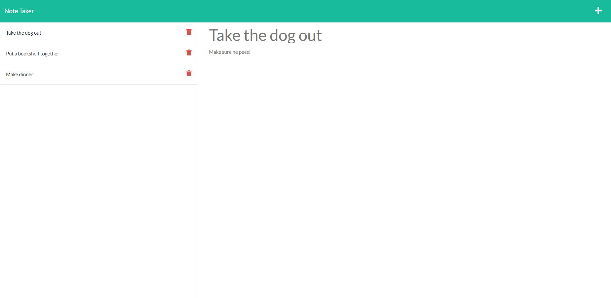

# Note Taker

  

  ## Description 

  Makes little notes for the user to look at later. Notes can be created and deleted on the user's whim.

  [Deployed on Heroku](https://frozen-beach-16707.herokuapp.com/)
  
  ## Table of Contents

  * [Installation](#installation)
  * [Usage](#usage)
  * [Technologies](#technologies)
  * [Credits](#credits)
  * [License](#license)
  * [Contributing](#contributing)
  * [Tests](#tests)
  * [Questions](#questions)
   
  ## Installation
  
  Simply download or clone into a directory. Node is a prerequisite along with express. Once node is installed and initialized run 'npm install express --save'. To launch the server run 'npm start'.
  
  ## Usage

  Organizes the user's notes in a clean and orderly fashion.
  
  
  

  ## Technologies
  
  * Javascript
  * Node
  * Express

  ## Credits

  Cole Sammons

  
  ## License
  [MIT License](https://opensource.org/licenses/MIT)

  Copyright &copy; 2021
  

  ## Contributing

  No contributions at the moment

  ## Tests

  No tests currently.

  ## Questions

  Contact through email for any inquiries.

  colemsammons@gmail.com

  [Github repo](https://github.com/ColeSammons/note-taker)
